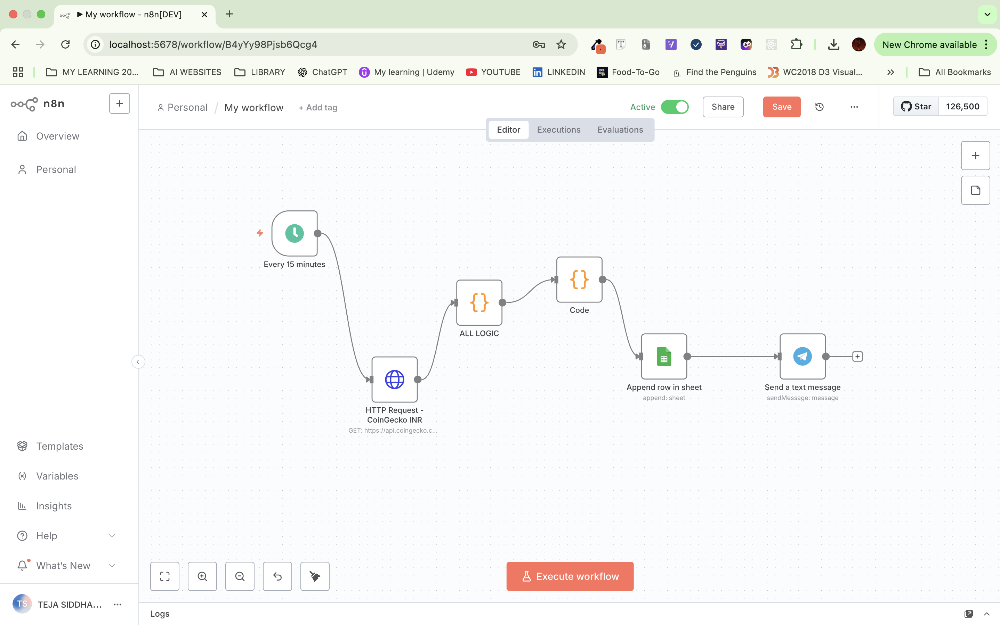
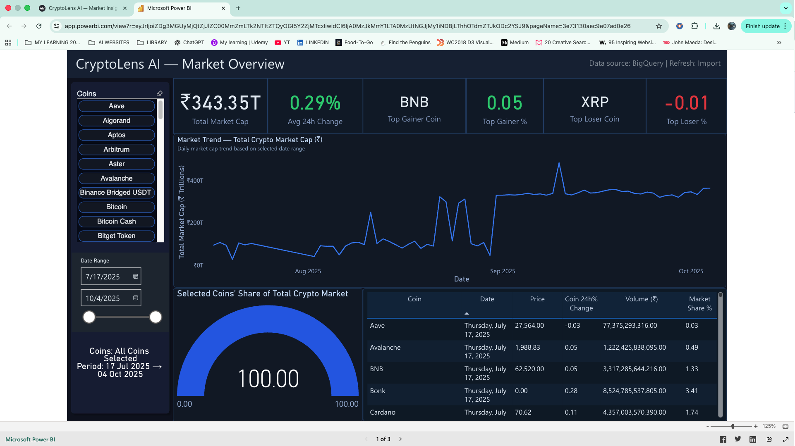
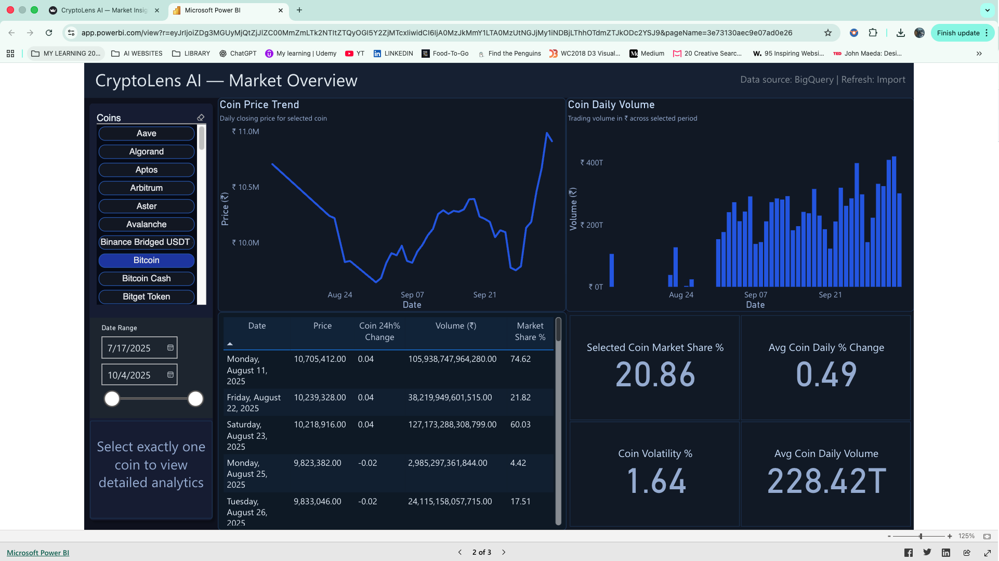
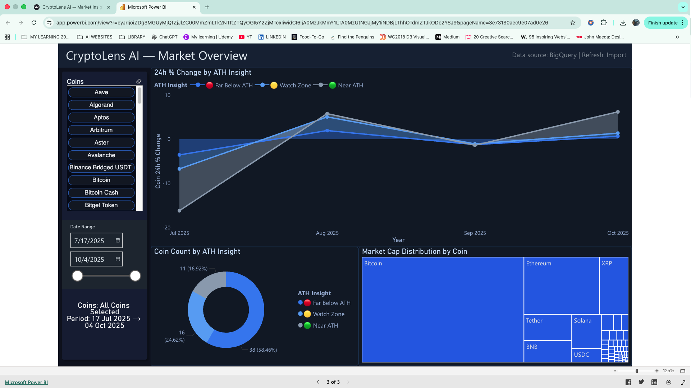
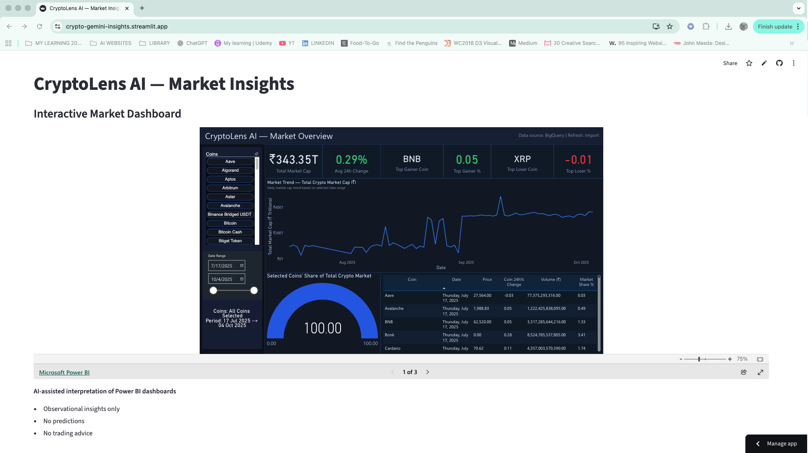
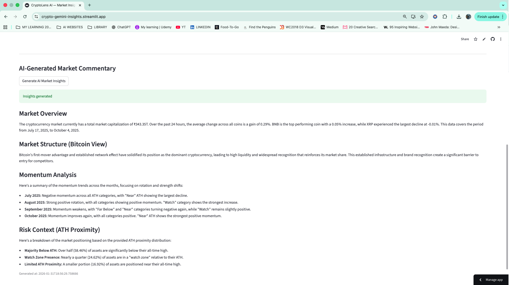
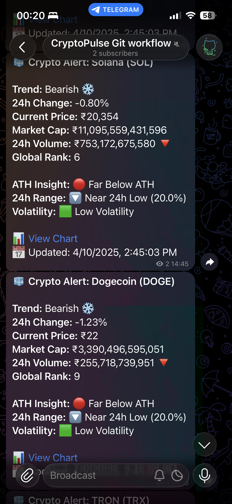

# CryptoLens AI — End-to-End Crypto Analytics (BI + AI)

CryptoLens AI is a **personal analytics engineering project** that demonstrates how
raw cryptocurrency market data can be transformed into **structured analytics,
interactive BI dashboards, and AI-assisted market commentary**.

The project mirrors a **real-world analytics lifecycle** — from ingestion and data
modeling to BI consumption and AI interpretation — with deliberate trade-offs around
**cost, scalability, and architectural clarity**.

---

## High-Level Architecture

The system follows a progressive analytics pipeline:

**Ingestion → Preparation → Warehouse → BI → AI → Application → Alerts**

Each layer is intentionally decoupled to reflect how real analytics platforms evolve.

---

## Phase 0 — Data Ingestion (n8n)

Raw crypto market data is ingested using **n8n**, focusing on reliability rather than
perfect cleanliness.



**What this layer handles:**
- Scheduled API ingestion
- Retry logic and fault tolerance
- Acceptance of missing or inconsistent fields
- Raw data capture for downstream analytics

This mirrors real ingestion systems where **data quality is handled later**, not at the source.

---

## Phase 1 — Data Preparation

Raw data is cleaned, normalized, and validated before analytics usage.

**Key transformations:**
- Standardized timestamps and currencies
- Numeric normalization (price, volume, market cap)
- Missing value handling
- Stable dataset creation (`crypto_cleaned_v1.csv`)

This step creates a **trustworthy analytical foundation**.

---

## Phase 2 — Cloud Data Warehouse (BigQuery)

Cleaned data is loaded into **BigQuery** and modeled for analytical workloads.

**Modeling approach:**
- Fact tables for market metrics
- Dimension tables for coins and time
- Derived metrics for:
  - ATH proximity
  - Momentum
  - Market share

The warehouse serves as the **single source of truth** for BI and AI layers.

---

## Phase 3 — Business Intelligence (Power BI)

Power BI connects directly to BigQuery and acts as the **primary analytics layer**.

### Market Overview Dashboard


### Coin-Level Analysis


### ATH Proximity & Market Structure


**Dashboards include:**
- Total crypto market cap
- Average 24h change
- Top gainers and losers
- Coin-level price, volume, and dominance
- ATH proximity classification
- Momentum trends over time

All visuals are based on **transformed warehouse data**, not mock datasets.

---

## Phase 4 — Application Layer (Streamlit)

Power BI dashboards are embedded inside a **Streamlit application** to provide a
single access point for analytics and insights.

### Embedded BI Interface


### AI Commentary Section


**Why Streamlit:**
- Lightweight deployment
- Minimal UI overhead
- Focus on analytics, not frontend complexity

---

## Phase 5 — AI-Assisted Market Commentary (Gemini)

Gemini AI is integrated to generate **human-readable market commentary** based on
aggregated dashboard metrics.

**Generated insights include:**
- Market overview summaries
- Momentum explanations
- ATH risk context

**Important constraints:**
- Observational only
- No predictions or trading advice
- Generated on demand (not per slicer interaction)
- Rate-limited to control API usage and cost

This reflects **responsible AI usage in analytics systems**.

---

## Phase 6 — Alerts & Distribution (Telegram)

Automated crypto alerts are delivered via **Telegram**, powered by the same curated
analytics pipeline.



**Alert contents:**
- Trend direction
- 24h price change
- Volume movement
- ATH proximity classification
- Volatility context

Alerts are designed for **situational awareness**, not trading signals.

---

## Current Status

- ✅ Ingestion → Cleaning → Warehouse → BI → AI fully connected
- ✅ Streamlit app deployed
- ✅ Gemini insights working with controlled usage
- ✅ Telegram alerts operational
- ❌ Real-time AI per slicer interaction (by design)

---

## Repository Structure

```text
n8n-crypto-live/
│
├── assets/
│   └── images/
│
├── 00_foundation_crypto_ingestion/
├── 01_data_preparation/
├── ai_insights_layer_02/
├── streamlit_app_03/
├── requirements.txt
└── README.md
